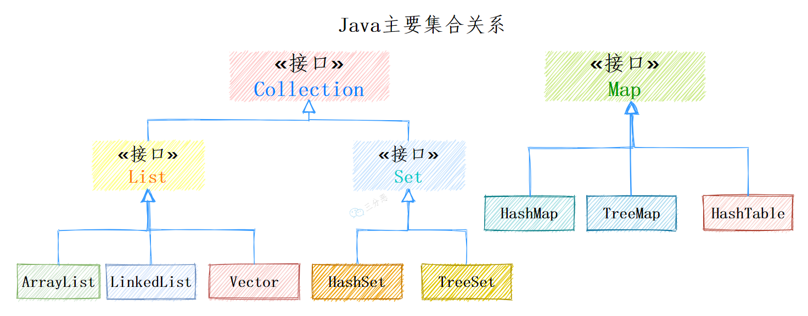

# Java基础
## equals() 和 hashCode() 
* `==` 用于基本类型变量值的相等判断；
* `equals()` 用于对象相等的判断：
	* Object类的equals方法内部是判断两个对象引用是否相等（地址是否相等）；
	* 一般需要判断的是两个引用类型变量的内部属性是否相等，所以需要重写equals；
* 重写equals：
	* 判断引用是否相等；
	* 判断对象类型是否相等；
	* 判断对象内部属性是否相等；
* `hashCode()`用于获取对象的哈希码：
	* Object类的hashCode方法是native的，底层由C/Cpp实现；**原生的hashCode()方法为不同的对象返回不同的整型值** ，这个整形值可能与对象的内存地址有关，但具体实现要看JVM版本；
	* 对象用于`散列表` 时，需要重写hashCode方法；
* 重写hashCode：
	* 可以使用`Objects.hash()` 方法等等；
	* 对对象的属性值按某个哈希函数进行哈希运算；
* 为什么重写equals，一定要重写hashCode？
	* 原因：出于效率
	* 在HashSet、HashMap、HashTable等集合中元素是无序的且不重复的，若单靠equals方法比较，时间复杂度是O(n)，但有了hashCode方法后，我们可以获取该对象的hash值用O(1)的时间复杂度来定位；若该位置上已有对象，使用equals方法进行判断对象内部属性是否相等。
	* 重写equals是为了判断两个对象内部属性是否相等，重写hashCode是为了保证equals相等的两个对象，一定能在散列表中落到同一个`桶` 中。
* 总结：
	* 两个对象的hashCode相等，那么这两个对象不一定相等（哈希碰撞）；
	* 两个对象的hashCode相等，且两个对象的equals返回true，那么认为这两个对象相等；
	* 两个对象的hashCode不相等，那么可以直接认为这两个对象不相等；

## String、StringBuilder、StringBuffer


## 常量折叠


## 包装类型
>Java 基本数据类型的包装类型的大部分都用到了缓存机制来提升性能。

`Byte、Short、Integer、Long`四种包装类型默认创建了`[-128, 127]` 的相应类型的缓存数据；
`Character` 创建了数值在`[0, 127]` 范围的缓存数据；
`Boolean` 直接返回`true` Or`false`；
* 自动拆箱与自动装箱
	* 装箱：将基本数据类型变量用它们对应的引用类型包装起来;
	* 拆箱：将包装类型变量转换为对应的基本数据类型变量；
```java
class Main {
	public static void main(String[] args) {
		Integer i = 10;//自动装箱：Integer i = new Integer(10);
		int j = i;//自动拆箱：
	}
}
```

## BigDecimal


# Java集合

可省略为：


## Collection接口
> 三大子接口：Set、List、Queue


## Map接口

* `Collection<V> values();`：返回map的所有value的集合，可以作为ArrayList的构造参数。


## ArrayList
```java
public class ArrayList<E> extends AbstractList<E>  
        implements List<E>, RandomAccess, Cloneable, java.io.Serializable  
{
	//...
}
```
* 是否线程安全：否，方法都没有使用`synchronized`关键字；
* 底层数据结构：底层是Object数组，支持动态扩容；
* 插入和删除是操作：
	* 直接插入：默认插入到数组尾部，时间复杂度为O(1)；
	* 指定位置插入：需要移动大量元素，时间复杂度为O(n)；
	* 指定元素移除/指定位置移除：时间复杂度O(n)；
* 快速访问：实现了`RandomAccess`接口，支持快速访问，通过索引直接访问底层数组；
* 内存空间占用：数组尾部会预留一定空间；
### 扩容机制
* 未指定容量初始化的空list，底层数组容量为0；
* 当加入第1个元素后，底层数组容量变为10；
* 当加入第11个元素后，底层数组触发`grow`扩容，扩容到原来的`1.5`倍；
### System.arraycopy() 和 Arrays.copyOf()
* ArrayList中的add方法用到了System.arraycopy()：当在指定位置添加元素时，需要将原有的一部分数据向后拷贝一位；
* ArrayList中的toArray()方法用到了Arrays.copyOf()：从原来的底层数组中，复制出一个新的数组并返回；

## LinkedList
```java
public class LinkedList<E> extends AbstractSequentialList<E>
		implements List<E>, Deque<E>, Cloneable, java.io.Serializable
{
	//...
}
```
* 是否线程安全：否
* 插入和删除操作：底层使用双向链表结构（非循环）
	* 头部插入、删除：O(1)；
	* 尾部插入、删除：O(1)；
	* 指定位置插入、删除：O(n)；
* 快速访问：LinkedList底层是链表，地址不连续，不支持快速访问，因此不能实现`RandomAccess`接口；
* 内存空间占用：链表的每个节点都拥有两个指针
### 删除节点
> 删除节点的核心方法是`unlink(Node<E> x)`方法
* 首先获取待删除节点x的前驱pre和后继节点next；
* 判断待删除节点x是否为头结点或尾节点：
	* 若x是头节点，则将虚拟头结点的后继指针指向x的后继节点，将x的后继节点的前驱指针指向虚拟头节点；
	* 若x是尾节点，则将虚拟尾节点的前驱指针指向x的前驱节点，将x的前驱节点的后继指针指向虚拟尾节点；
	* 若x不是头节点，也不是尾节点，执行下一步操作；
		* 将待删除节点x的前驱节点的后继指针指向x的后继节点pre，将x的前驱指针置为null；
		* 将待删除节点x的后继节点的前驱指针指向x的前驱节点next，将x的后继指针置为null；
* 将待删除节点x置为nul，修改链表长度；

## HashMap
> 主要用于存放键值对，实现了Map接口，非线程安全。
```java
public class HashMap<K,V> extends AbstractMap<K,V>
		implements Map<K,V>, Cloneable, Serializable 
{
	//...
}
```

* 设计组成：JDK1.8之前，HashMap底层是 `数组 + 链表`实现；JDK1.8之后，HashMap底层是`数组 + 链表/红黑树`实现（在链表长度达到某个阈值时，转化为红黑树；在红黑树节点数小于某个阈值时，退化为链表）
* 重要属性：
	* `loadFactor--负载因子`：
		* 
	* `threshold--阈值`：
		* `threshold = capacity * loadFactor`，当`size > threshol`时，就需要考虑对数组进行扩容，会设计到rehash。
	* `Node节点`：
	* `TreeNode节点`：


* **桶数组是用来存储数据元素的，链表是用来解决哈希冲突的，红黑树是为了提高查询的效率**；
* 数据元素通过映射关系（扰动函数获取hash值，再对(length-1)做`&`运算），映射到桶数组对应索引的位置；
* 若发生冲突（不相等的两个元素被映射到同一个位置/元素被映射到的位置已经存在元素了），从冲突的位置拉一个链表，插入冲突的元素；
* 若`链表长度 > 8 & 数组capacity >= 64`，链表转化为红黑树；若链表长度大于8，但数组容量小于64，则只进行数组扩容（2倍扩容）；
* 若红黑树节点个数小于6，红黑树转化为链表；
### 红黑树的概念
> 本质上是一种保持平衡的二叉查找树（搜索树）。

* 红黑树的基本规则：
	* 只有红黑两种节点；
	* 根节点永远是黑色；
	* 所有叶子节点（NULL值节点）都是黑色的；
	* 每个红节点的两个子节点一定是黑色；
	* 从任一节点到其子树中每个叶子节点的路径都包含相同数量的黑色节点；
* 与二叉树、平衡二叉树的对比：
	* 红黑树的插入、删除、查找操作的最坏时间复杂度都是`O(logn)`。
	* 对比二叉树：最坏情况下插入、删除、查找操作的时间复杂度是`O(n)`（退化成了链表）。
	* 对比平衡二叉树：平衡二叉树为了保持平衡（每个节点的左右子树高的差值的绝对值<=1），需要旋转的次数更多，插入和删除效率低。
* 红黑树保持平衡：
	* 两种方式：`旋转`、`染色`
	* 旋转：
		* 左旋：
		* 右旋：
	* 染色：
### 链表与红黑树的转换


# Java IO

# Java反射、动态代理


# JVM


# JUC
## synchronized锁升级原理
> synchronized锁升级原理涉及Java对象内存布局、JVM指针压缩。

### JVM指针压缩
> 32位系统内存不够用，64位系统内存够用但太大影响性能（GC、CPU）
> 使用`压缩指针`，在64位的操作系统中利用32位的对象指针引用获得超过4G的内存寻址空间。
1. 第一步压缩：32/64位系统中，对象地址的末尾三位固定都是0，这3位0可以不存储，而用多出来的3位存储额外的地址信息。即寻址的时候，左移三位，补3个0，寻址范围大约变成了32G；压缩的时候右移3位，隐藏这三个0。
2. 可以通过设置虚拟机参数来改变对象对齐的字节倍数，若设置为16的倍数，那么就会多出4bit，寻址范围扩大到了64G。
> 最好还是保持32G，即按8字节对齐。

### Java对象结构
> Java对象由三部分组成。
1. 对象头：对象头也由三部分组成。
	1. Mark Word：存储对象的hashCode、垃圾回收对象的年龄、锁信息等；
	2. 类型指针：指向该对象的Class类型的内对地址。
	3. 数组长度：若对象是数组，才有这部分数据；否则没有，不分配空间。
2. 对象体：对象所有非静态属性占用的空间（包括父类的所有属性，不包括方法），若属性是基本数据类型则直接存本身，若属性是引用类型则存指针（引用）。
3. 对齐填充：对象头 + 对象体所占空间不是8字节的倍数，则填充使整个对象结构为8字节的倍数。
#### 对象头
> 12字节或16字节，以下默认为开启了指针压缩。若没有开启指针压缩，那么类型指针变为8字节。
##### Markword（8字节）
> 占64bit，存储对象的hashCode、GC年龄、锁状态


##### 类型指针（4字节）
> 为什么类型指针是4字节？压缩指针的情况下只有32位，其他3位0隐藏。
##### 数组长度（0或4字节）

#### 对象体
存放的是非静态属性对象（包括父类的所有非静态属性，不区分可见性修饰符），基本类型的属性存放的是具体的值，引用类型（包括数组类型）存放的是引用指针。

#### 对齐填充


