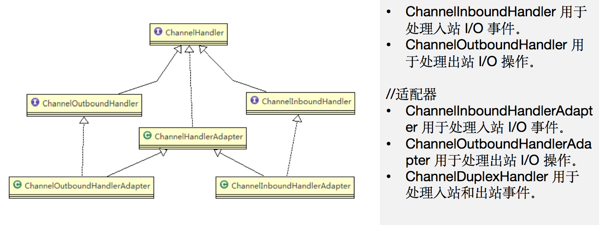
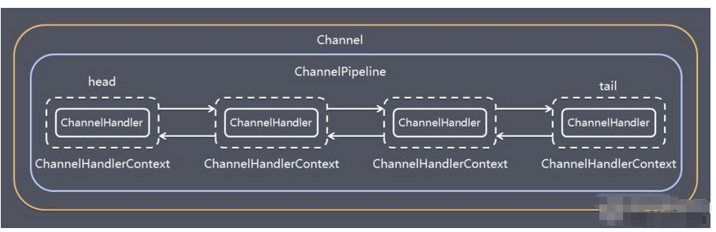

> Netty是异步事件驱动的框架，网络IO模型采用的是NIO（同步非阻塞IO）。
# I/O
## I/O的步骤
 > 一般I/O分为两步：
* 等待：等待缓冲区里数据的准备，接受到的数据会先存在内核缓冲区中（page cache）
* 数据搬移：数据从内核缓冲区搬移到用户空间中

## 五种I/O模型
* 阻塞I/O模型：调用`xxx`系统调用后，会有两个等待（这两个等待都会使线程阻塞挂起）
	* 第一个阻塞等待：等待缓冲区里数据准备好，接受到的数据会先存在内核缓冲区中；
	* 第二个阻塞等待：等待内核缓冲区里的数据拷贝到用户空间；
* 非阻塞I/O模型：调用`xxx`系统调用后，会先检查内核数据是否准备好，如果没准备后会立即返回，用户需要 不断调用 或者 间隔一段时间调用（期间可以做一会别的事情） 该系统调用去检查内核数据是否准备好；一旦某一次检查到内核数据准备好了，就会阻塞等待内核缓冲区里的数据拷贝到用户空间；
	* 多个轮询访问：多次调用`xxx`系统调用查看内核数据是否准备好；
	* 一个阻塞等待：一旦内核数据准备好，就立马阻塞等待数据从内核缓冲区拷贝到用户空间；
* 多路复用I/O模型：select / poll / epoll 都属于多路复用I/O模型，
	* select：将需要监听的socket存放到select的文件描述符集合当中，该文件描述符集合是位图形式的，大小为1024，意味着我们使用select最多可以监听1024个socket。当我们调用select的时候，会将文件描述符集合`拷贝`到内核空间，让内核来检查是否有事件发生，检查就是`遍历`文件描述符集合，当检查到有事件发生时，将对应的文件描述符标记为可读/可写。当一次遍历完，再把整个文件描述符集合`拷贝`到用户空间，用户还需要`遍历`找到可读/可写的socket。
		* 两次拷贝：
			* 第一次：将文件描述符集合拷贝到内核空间，交给内核监听事件；
			* 第二次：将文件描述符集合拷贝到用户空间，交给用户处理事件；
		* 两次遍历：
			* 第一次：内核会以遍历文件描述符集合的方式，检查是否有事件发生；
			* 第二次：用户需要遍历文件描述符集合找到内核标记了发生事件的socket；
	* poll：不再使用位图作为文件描述符集合，使用链表组织的动态数组来维护，但同样还是需要扫描，
	* epoll：使用`epoll_create`创建epoll对象，调用`epoll_ctl`将需要监听的socket交给epoll来监听，最后调用`epoll_wait`等待数据。epoll在内核中维护红黑树来保存交给epoll监听的socket，并维护一个链表来记录就绪事件，所有事件发生了的socket都会加入到该链表当中，当用户调用epool_wait时，内核中的就绪事件socket链表会拷贝到用户空间，不再需要扫描的方式来确定那个文件描述符发生了事件。
	* 多路复用I/O模型在一次系统调用select/poll/epoll后，仍然需要阻塞，但能够监听到多个socket的数据是否准备好，从每个socket中读取数据时，还是会阻塞一次；
		* 第一个阻塞等待：调用select/poll/epoll同时检查多个socket的内核数据是否准备好；
		* 接着n个阻塞等待：对select/poll/epoll返回的n个准备好数据的socket，每一个都需要调用系统调用将他们从内核缓冲区读取到用户空间中。
* 信号驱动I/O模型：线程先向内核注册一个信号处理函数，然后用户线程返回不阻塞，当内核数据准备好时向线程发送一个信号，线程在对应的信号处理函数中调用I/O（阻塞）读取数据，即将数据从内核拷贝到用户空间
	* 一个阻塞等待：线程接受到信号后执行信号处理函数调用I/O阻塞读取数据。
* 异步I/O模型：线程调用`xxx`系统调用后立即返回，内核将`准备内核数据`、`内核数据拷贝到用户空间`这两个操作都完成后再发送信号给线程，线程执行自定义的信号处理函数。

## 易混淆概念
* 同步与异步：主要看请求发起方对于消息结果的获取是主动发起的（同步），还是被动通知的（异步）；
* 同步阻塞：请求方主动发起后，需要一直阻塞等待（等待内核数据准备，等待数据从内核拷贝到用户空间）
* 同步非阻塞：请求方主动发起后立即返回，间隔时间（期间可以做其他事情）来询问内核数据是否准备好，当某次询问发现数据准备好后，再阻塞等待数据从内核拷贝到缓冲区。
* 异步阻塞：请求⽅发起请求，⼀直阻塞等待应答结果
* 异步非阻塞：请求方发起后，立即返回，直到内核数据准备后、数据从内核拷贝到用户空间后才接到通知直接处理数据。

## select / poll / epoll

## epoll的事件触发模式：边缘触发、水平触发
* 边缘触发：当被监控的socket上有可读事件发生时，服务器端只会从epoll_wait中苏醒一次，即使进程没有调用read从内核读取数据，也依然只会苏醒一次，因此需要保证一次性将内核缓冲区中的数据读完。 
* 水平触发：当被监控的socket上有可读事件发生时，服务器端不断地从epoll_wait中苏醒。即只要监听的socket有可读事件发生就会苏醒，只要数据未被读取的socket再次被epoll_wait，就会立即苏醒，

## 高性能网络模式---Reactor
> 应用：Redis、Nginx、Netty
> Reactor模式也称为Dispatcher模式。

* I/O多路复用select、poll、epoll的使用方式是面向过程的方式；
* 而Reactor是基于select、poll、epoll封装出的面向对象方式的网络模式；

> Reactor模式主要由 Reactor 和 处理资源池（线程池） 这两个核心部分组成
* Reactor负责监听、分发事件，事件类型包含连接事件、读写事件；
* 处理资源池负责处理事件，如：read->业务逻辑->send；

> Reactor 模式是灵活多变的，可以应对不同的业务场景，灵活在于：
- Reactor 的数量可以只有一个，也可以有多个；
- 处理资源池可以是单个进程 / 线程，也可以是多个进程 /线程；
> 排列组合这两个因素：
* 一个Reactor，一个进程 / 线程；
* 一个Reactor，多个进程 / 线程；
* 多个Reactor，一个进程 / 线程；---这种方式没必要
* 多个Reactor，多个进程 / 线程；

一般在Reactor模式下，因为是面向对象的方式，会有Reactor、Acceptor、Handler等
### 一个Reactor，一个进程 / 线程
> Redis使用的就是`单Reactor单进程`。

* Reactor负责 监听、分发事件：
	* 如果是连接事件，则调用Acceptor对象处理连接；
	* 如果是读/写事件，则调用Handler对象处理业务逻辑；

* 缺点：
	* 单进程 / 线程，无法利用CPU多核的性能；
	* Handler若处理了一个耗时很长的业务逻辑，那么会阻塞其他事件的响应；

### 一个Reactor，多个进程 / 线程

* Reactor负责 监听、分发事件：
	* 如果是连接事件，则调用Accept对象处理连接；
	* 如果是读/写事件，则调用对应的Handler类型，创建对应的Handler对象，该Handler对象会调用方法，方法内会将业务逻辑交给共享的线程池中的线程来处理

* 缺点：
	* 需要注意并发线程对共享资源可能存在线程安全问题；
	* 一个Reactor对象在高并发的情况下，容易称为瓶颈；


### 多个Reactor，多个进程 / 线程
> Netty、Memcache都是基于`多Reactor多进程/多线程`的方案。

* 分为主Reactor（主线程）和多个子Reactor（多个子线程）；
* 主Reactor只负责 监听连接事件、分发已经连接完成的socket：
	* 当连接事件发生，主Reactor立即调用Acceptor处理连接事件；
	* 然后将连接完成的socket，分发给多个子Reactor中的一个；
* 每个子Reactor是一个线程，每个子Reactor负责监听已连接的socket上的读写事件的发生、业务逻辑的处理：
	* 当子Reactor所监听的已连接socket的读/写事件到来，则调用对应的Handler来处理（Handler可继续调用线程池中的线程进行处理）

* 好处：
	* 主线程、子线程分工明确，主线程负责监听连接、分发连接，子线程负责监听自己管理的已连接的socket、处理业务逻辑

## Proactor


## 零拷贝


# Java NIO

## Buffer

## Channel

## Selector


# Netty
## Netty 网络模型
> Netty主要基于主从Reactor（多Reactor）多线程模型。


1. Netty抽象出两组“线程池”，Boss Group专门负责接收客户端的连接，Worker Group负责网络的读/写；
2. Boss Group和Worker Group的类型都是 NioEventLoopGroup；
3. NioEventLoopGroup相当于一个事件循环组，这个组中包含有多个事件循环，每一个事件循环是一个 NioEventLoop；
4. NioEventLoop表示一个不断循环的执行处理任务的线程，每个NioEventLoop都有一个Selector，用于监听绑定在其上的socket的accept / read / write事件；
5. NiotEventLoopGroup可以包含多个线程，即可以包含多个NioEventLoop；
6. 每个Boss Group中的NioEventLoop循环执行的步骤有3步：
	1. 轮询accept事件；
	2. 处理accept事件，与client建立连接，生成 NioSocketChannel，并将其注册到Worker Group中的某个NioEventLoop上的Selector；
	3. 处理任务队列的任务，runAllTasks（在Boss Group这里就是处理一次select调用返回的所有连接事件的任务）；
7. 每个Work Group中的NioEventLoop循环执行的步骤有3步：
	1. 轮询read / write事件；
	2. 处理I/O事件，即read / write事件，在对应的NioSocketChannel处理；
	3. 处理任务队列的任务，runAllTasks（在Worker Group这里就是处理一次select调用返回的所有read / write事件的任务）
8. 每个Work Group中的NioEventLoop处理业务时，会使用 Channel，每个Channel对应一个ChannelPipeline，每个ChannelPipeline将多个ChannelHandler串联起来，会串行调用ChannelHandler来处理事件。

* 每个NioEventLoop中包含一个Selector，一个taskQueue；
* 每个NioEventLoop中的Selector上可以注册监听多个NioChannel；
* 每个NioChannel只会绑定在唯一的NioEventLoop上；
* 每个NioChannel都绑定一个自己的ChannelPipeline；
* 每个ChannelPipeline中有一个链表形式的ChannelHandler
* 可以使用pipeline.addLast()方法添加自定义的ChannelHandler到pipeline中；
* 自定义ChannelHander类需要继承ChannelHandlerAdapter的子类，其中
	* 继承ChannelOutboundHandlerAdapter更多的是用于处理写相关操作；
	* 继承ChannelInboundHandlerAdapter更多的是用于处理读相关操作；

## Future机制
> Netty的异步模型是基于 future 和 callback 的。
> callback就是回调；
> future的核心思想是：假设一个function，计算过程可能非常耗时，我们调用该function后一直等待他返回显然是不合适的。可以在调用该function时，立即返回一个future，后续我们只需要通过该future去监控fun是否返回接即可。（Future-Listener机制）

### ChannelFuture
```java
public interface ChannelFuture extends Future<Void> {
	Channel channel();  
	ChannelFuture addListener(GenericFutureListener<? extends Future<? super Void>> var1);  
	ChannelFuture addListeners(GenericFutureListener<? extends Future<? super Void>>... var1);  
	ChannelFuture removeListener(GenericFutureListener<? extends Future<? super Void>> var1);  
	ChannelFuture removeListeners(GenericFutureListener<? extends Future<? super Void>>... var1);  
	ChannelFuture sync() throws InterruptedException;  
	ChannelFuture syncUninterruptibly();  
	ChannelFuture await() throws InterruptedException;  
	ChannelFuture awaitUninterruptibly();  
	boolean isVoid();
}
``` 

* 可以通过`addListener`方法来添加监听器，当监听的事件发生时，就会通知到监听器。

> 另外，ChannelFuture继承了Future类，Future类由继承了java.util.concurrent.Future类，因此ChannelFuture还有很多继承的方法可以使用：


> 比如，bind方法是异步的，可以根据它所返回的future（ChannelFuture），为其注册一个监听器，当bind方法完成，将会调用响应的监听器处理逻辑。
```java
ChannelFurure cf = bootStrap.bind(6668).sync;
cf.addListener(new ChannelFuture() {
	@Override
	public void operationComplete(ChannelFuture future) throws Exception {
		if (future.isSuccess()) {
			//成功的逻辑
		} else {
			//失败的逻辑
		}
	}
});
```


### 使用Netty搭建简单的Http服务

## Netty核心组件
### Bootstrap、ServerBootstrap

```java
//常用方法
group(workGroup);//Bootstrap
group(bossGroup, workerGroup);//ServerBootgroup
channel();//服务端使用NioServerSocketChannel.class，客户端使用NioSocketChannel.class
option();//给ServerChannel添加配置，通常设置ChannelOption.SO_BACKLOG
childOption();//给接收到的channel添加配置，通常设置ChannelOption.SO_KEEPALIVE
childHandler();//用来设置业务处理类（向pileline中添加自定义的Hanlder）
bind();//服务端绑定端口
connect();//客户端用于连接服务端
```

### Future、ChannelFuture
> 对于异步操作，我们调用后立即返回一个future / channelfuture，然后在返回的future上注册监听器。
### Channel

```java
NioSocketChannel//异步的客户端TCP socket连接
NioServerSocketChannel//异步的服务器端TCP socket连接
NioDatagramChannel//异步的UDP连接（UDP连接没有客户端、服务端的概念）
NioSctpChannel//异步的客户端Sctp连接
NioSctpSedrverChannel//异步的服务器端Sctp连接
```

### Selector
> Netty基于Selector实现 I/O 多路复用，通过Selector一个线程可以监听多个连接的Channel事件；
> 当向一个Selector中注册Channel后，Selector就会不断轮询这些注册的Channel是否有已有序的I/O事件；
> 在BossGroup中，Selector只轮询检查accept事件；
> 在WorkerGroup中，Selector轮询检查read / write事件；

### ChannelHandler及其实现类

#### 心跳机制的实现
> 心跳机制可以往pipeline中添加一个`IdleStateHandler`来实现。

### Pipeline和ChannelPipeline

### ChannelHandlerContext

### ChannelOption

### EventLoopGroup及其实现类NioEventLoopGroup

### Unpooled类

## 编码器、解码器

## TCP粘包、拆包问题

## 自定义协议+编、解码器解决TCP粘包、拆包


