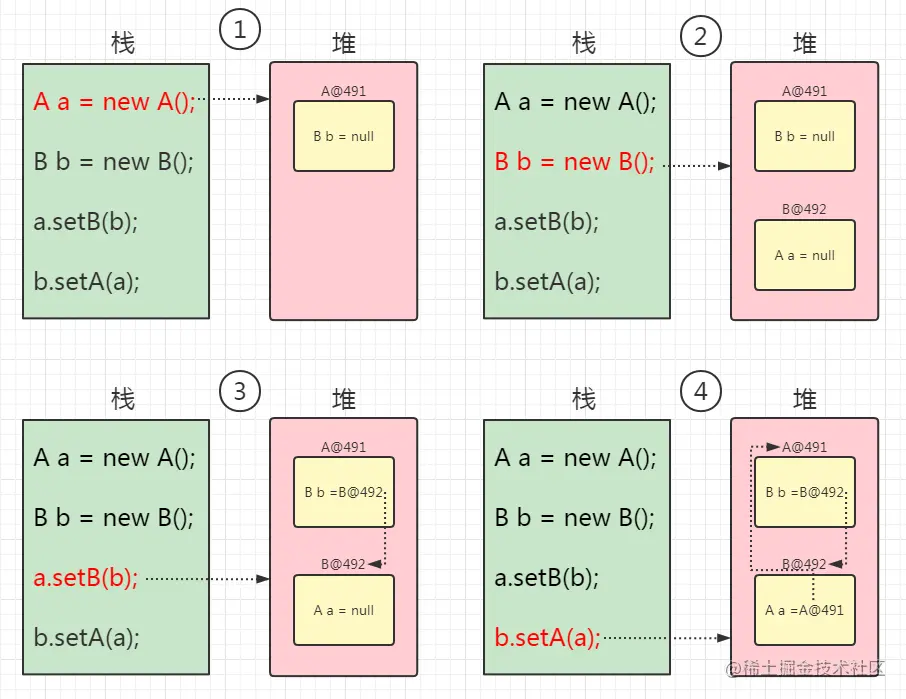

# Spring框架及其子模块
> Spring中各个模块的依赖关系如下，注意：**当我们导入任意一个模块时，他所依赖的模块都会被导入**，比如我们只导入`spring-context`，那么它所依赖的`spring-core、spring-context、spring-beans、spring-expression`都会被导入。


## Core Container
> Spring 框架的核心模块，也可以说是基础模块，主要提供 IoC 依赖注入功能的支持。Spring 其他所有的功能基本都需要依赖于该模块。

- **spring-core**：Spring 框架基本的核心工具类。
- **spring-beans**：提供对 bean 的创建、配置和管理等功能的支持。
- **spring-context**：提供对国际化、事件传播、资源加载等功能的支持。
- **spring-expression**：提供对表达式语言（Spring Expression Language） SpEL 的支持，只依赖于 core 模块，不依赖于其他模块，可以单独使用。
## AOP
> AOP

- **spring-aspects**：该模块为与 AspectJ 的集成提供支持。
- **spring-aop**：提供了面向切面的编程实现。
- **spring-instrument**：提供了为 JVM 添加代理（agent）的功能。 具体来讲，它为 Tomcat 提供了一个织入代理，能够为 Tomcat 传递类文 件，就像这些文件是被类加载器加载的一样。没有理解也没关系，这个模块的使用场景非常有限。

## Data Access/Integration
- **spring-jdbc**：提供了对数据库访问的抽象 JDBC。不同的数据库都有自己独立的 API 用于操作数据库，而 Java 程序只需要和 JDBC API 交互，这样就屏蔽了数据库的影响。
- **spring-tx**：提供对事务的支持。
- **spring-orm**：提供对 Hibernate、JPA、iBatis 等 ORM 框架的支持。
- **spring-oxm**：提供一个抽象层支撑 OXM(Object-to-XML-Mapping)，例如：JAXB、Castor、XMLBeans、JiBX 和 XStream 等。
- **spring-jms** : 消息服务。自 Spring Framework 4.1 以后，它还提供了对 spring-messaging 模块的继承。

## Spring Web
- **spring-web**：对 Web 功能的实现提供一些最基础的支持。
- **spring-webmvc**：提供对 Spring MVC 的实现。
- **spring-websocket**：提供了对 WebSocket 的支持，WebSocket 可以让客户端和服务端进行双向通信。
- **spring-webflux**：提供对 WebFlux 的支持。WebFlux 是 Spring Framework 5.0 中引入的新的响应式框架。与 Spring MVC 不同，它不需要 Servlet API，是完全异步。

# Spring特性
* IoC和DI；
* AOP面向切面编程；
* 声明式事务（不需要通过硬编码的方式进行事务管理）；
* 快速测试；
* 快速集成；
* 复杂API模板封装；

# Spring常用注解
> Spring 有很多模块，甚至广义的 SpringBoot、SpringCloud 也算是 Spring 的一部分，我们来分模块，按功能来看一下一些常用的注解：


## Web
* @Controller：组合了@Component注解，应用在MVC控制层；
* @RestController：@ResponseBody + @Controller，表示该类是一个MVC的handler，且所有方法都默认将数据放在响应体中返回，且告知前端控制器`DispatchServlet`不需要在去请求试图解析器。
* @RequestMapping：用于Web映射，包括请求路径和参数；若是Restful风格接口，还支持：
	* @GetMapping：
	* @PostMapping：
	* @PutMapping：
	* @DeleteMapping：
* @ResponseBody
* @RequestBody：从请求体中获取数据
* @PathVariable：接受路径参数
## 容器
* @Component：
* @Service：组合注解，应用在Service业务逻辑层；
* @Repository：组合注解，应用在dao数据访问层；
* @Autowired：Spring提供的自动依赖注入注解，由BeanPostProcessor和BeanPostProcrssFactory自动注入；
* @Qualifier：指定`@Autowired`注入的bean的名字；
* @Configuration：标注该类为配置类，可被Spring扫描到；相当于xml配置文件；
* @Value：可以提取配置文件中的值赋值给变量；
* @Bean：
* @Scope：以什么方式去创建bean（bean的作用域）；eg：Singleton、Prototype、Request、Session、GlobalSession

## AOP
* @Aspect：什么一个类为切面类，在该类中可以定义通知方法；
	* @After
	* @Before
	* @Around
	* @PointCut：声明切点

## 事务
* @Transactional：

# Spring中用到的设计模式

# IoC & AOP & Bean
> IoC--`Inversion of Control`--控制反转，AOP--面向切面编程
## IoC
> - **使用 IoC 思想的开发方式** ：不通过 new 关键字来创建对象，而是通过 IoC 容器(Spring 框架) 来帮助我们实例化对象。我们需要哪个对象，直接从 IoC 容器里面去取即可。

* **控制**：对象的实例化、管理的权力；
* **反转**：控制权交给外部环境（IoC容器）；
* **好处**：对象之间耦合度降低，资源管理简单；
* **IoC与DI**：DI全名为**依赖注入**，IoC是一种设计思想，DI是IoC的实现方式。

### Spring IoC Container
> 容器是IoC最重要的部分
* BeanFactory是容器的接口；
* ApplicationContext继承了BeanFactory继承，并加以补充；
* ClassPathXmlApplicationContext、FileSystemXmlApplicationContext实现了ApplicationContext接口；
> Spring在启动容器的时候，就已经创建好了所有的`Singleton`的Bean对象。

### BeanFactory 与 ApplicationContext
> BeanFactory是Spring的心脏，ApplicationContext是Spring的身体。
* BeanFactory采用的是延迟初始化（懒加载）的方式，只有第一次`getBean()`获取Bean的时候，才会实例化Bean；
* ApplicationContext是在启动时就预先创建并初始化所有的Bean。

### Spring容器启动阶段
> Spring 的 IoC 容器工作的过程，其实可以划分为两个阶段：**容器启动阶段**和**Bean 实例化阶段**。

* 容器启动阶段：
	* 加载配置
	* 分析配置信息
	* 装配到BeanDefinition
	* 其他处理
* Bean实例化阶段：
	* 通过BeanDefinition实例化对象；
	* 装配依赖；
	* 生命周期回调；
	* 对象其他处理；
	* 注册回调接口；
### IoC示例
#### 基于XML文件方式配置Bean对象
* 引入jar包：
```xml
<!-- 依赖于spring-core、spring-aop、spring-beans、spring-expression，这些都会被导入 -->
<dependency>  
    <groupId>org.springframework</groupId>  
    <artifactId>spring-context</artifactId>  
    <version>5.3.15</version>  
</dependency>  
  
<dependency>  
    <groupId>org.projectlombok</groupId>  
    <artifactId>lombok</artifactId>  
    <version>1.18.22</version>  
</dependency>
```
* 新建一个自定义类，待会交给Spring管理（注入到IoC容器当中）
```java
@Data  
public class DataConfig {  
    private String url;  
    private String username;  
    private String driverName;  
    private String passwd;  
}
```
* 在`resources`下新建`spring.xml`配置类
```xml
<?xml version="1.0" encoding="UTF-8"?>  
<beans xmlns="http://www.springframework.org/schema/beans"  
       xmlns:xsi="http://www.w3.org/2001/XMLSchema-instance"  
       xsi:schemaLocation="http://www.springframework.org/schema/beans http://www.springframework.org/schema/beans/spring-beans.xsd">  
  
    <bean class="cn.zyy.ioc.DataConfig" id="config">  
        <property name="username" value="root"/>  
    </bean>  
</beans>
```
* 通过`ClassPathXmlApplicationContext`类获取bean对象
```java
public class Main {  
  
    public static void main(String[] args) {  
       ClassPathXmlApplicationContext ctx = new ClassPathXmlApplicationContext("spring.xml");  
       DataConfig bean = (DataConfig) ctx.getBean("config");  
  
       System.out.println(bean.getUsername());  
  
    }}
```
* 或者直接在代码中通过`@Autowired`注解注入
#### 基于注解方式配置Bean对象
* 使用`@Component、@Repository、@Service、@Controller`在类上标注，使之成为Bean对象；
```java
@Component
public class DataConfig {
	//....
}
```
* 使用`@Configuration`注解定义一个配置类，在配置类中创建方法，方法的返回值是我们要注入IoC容器的类的对象，可以在方法内对该对象进行配置，在方法上使用`@Bean`注解；
```java
@Configuration
public class XxxConfig {
	
	@Bean
	public XxxObj xxxObj(...) {
		//创建XxxObj对象
		//设置属性
		
		return ...;//返回创建的对象
	}
}
```

## Bean
### BeanDefinition 与 Bean
> BeanDefiniition是Spring容器创建、保存Bean的信息提供。

* BeanDefinition是Spring中用来描述bean的顶级接口，里面存放Bean的元数据，如Bean的类型、构造函数参数列表、所依赖的Bean、是否是单例Bean、是否懒加载等信息。
* Bean是我们需要的对象，从Spring容器中获得的对象实例就是Bean。

### Bean的生命周期
> 实例化--> 属性赋值 -->初始化 -->使用 -->销毁

* 实例化：

### Bean的作用域
> singleton、prototype、request、session、global-session

### Spring中的单例Bean的线程安全问题
> 单例Bean存在线程安全问题，也就是多个线程同时对Bean的操作可能会造成意料之外的结果；
> 但大多数线程操作都是对Bean进行查询操作，即使用Bean中的方法等，一般不会修改；
> 大多数Bean都是无状态的，只关注与方法本身；

* 解决单例Bean线程安全问题：
	* 将Bean定义为多例，每个线程请求都获取一个独立的Bean；
	* 将Bean的成员变量保存在ThreadLocal中；

### 循环依赖问题
```java
class A { private B b; public void setB(B b) {this.b = b;} } class B { private A a; public void setA(A a) {this.a = a;} }
```
> 上面这种情况称之为A、B循环依赖问题，但是这种循环依赖是可以解决的。
* 思想：先实例化，后设置属性
```java
A a = new A(); 
B b = new B(); 
// 依赖注入 
a.setB(b); 
b.setA(a);
```
实际上就如下图这样：

> 循环依赖的对象，如果无法做到先实例化，后设置依赖（属性），那么这种循环对象是无法解决的；

```java
class A {
	private B b; 
	public A(B b) { this.b = b; } 
} 

class B { 
	private A a; 
	public B(A a) { this.a = a; } 
}
```
> 循环依赖的两个对象，只能通过构造方法创建对方，且构造方法还需要对方的实例。

### Bean的循环依赖问题
> A依赖B且B依赖A，或者C依赖C，就构成了循环依赖

* Prototype作用域的Bean，Spring启动时会直接报错；
* Singleton作用域的Bean，Spring会根据注入方式解决一部分；
### Spring可解决的Bean循环依赖类型
> Spring中存在的三种依赖注入方式：
* 基于 构造方法 的依赖注入；--无法解决
* 基于 setter() 方法的依赖注入；--可以解决
* 基于 成员变量 的依赖注入；--可以解决

> Spring只能解决Singleton作用域的Bean的基于setter() / 成员变量的依赖注入方式的循环依赖问题。

### 三级缓存解决循环依赖问题
> 一个Bean要初始化完成，至少需要三步：
* 实例化：
* 属性赋值：注入
* 初始化：

> 三级缓存：
* 一级缓存：`Map<String,Object>` **singletonObjects**，单例池，用于保存实例化、属性赋值（注入）、初始化完成的 bean 实例
* 二级缓存：`Map<String,Object>` **earlySingletonObjects**，早期曝光对象，用于保存实例化完成的 bean 实例
* 三级缓存：`Map<String,ObjectFactory<?>>` **singletonFactories**，早期曝光对象工厂，用于保存 bean 创建工厂，以便后面有机会创建代理对象。

> 为什么二级缓存不行？


## AOP
> AOP（Aspect Oriented Programming）即面向切面编程，AOP 是 OOP（面向对象编程）的一种延续，二者互补，并不对立。

* AOP 的目的是将横切关注点（如日志记录、事务管理、权限控制、接口限流、接口幂等等）从核心业务逻辑中分离出来，通过动态代理、字节码操作等技术，实现代码的复用和解耦，提高代码的可维护性和可扩展性。
* OOP 的目的是将业务逻辑按照对象的属性和行为进行封装，通过类、对象、继承、多态等概念，实现代码的模块化和层次化（也能实现代码的复用），提高代码的可读性和可维护性。

* 横切关注点：多个类或对象中的公共行为（如日志记录、事务管理、权限控制、接口限流、接口幂等等）；
* 切面：
* 连接点：
* 通知：
* 切点：
* 织入：

### 静态代理
> 比较简单，是通过硬编码的方式，代理类需要实现和目标类一样的接口。
* 接口类：
```
public interface ISolver {  
    void solve();  
}
```
* 目标类：
```java
public class Solver implements ISolver {    
    @Override  
    public void solve() {  
       System.out.println("解决问题...");  
    }
}
```
* 代理类：代理类要实现接口，并且维护一个目标对象（简单来说，就是代理类拥有一个被代理的对象，调用代理类执行方法时，代理类方法中再调用被代理类的方法）
```java
public class SolverProxy implements ISolver {  
	//目标对象（被代理对象）
    private ISolver target;  
  
    public SolverProxy(ISolver target) {  
       this.target = target;  
    }  
    
    @Override  
    public void solve() {  
       System.out.println("获取问题...");  
       target.solve();  
       System.out.println("问题解决...");  
    }
}
```
* 测试：
```java
	ISolver solver = new Solver();
	SolverProxy solverProxy = new SolverProxy(solver);  
	solverProxy.solve();//调用代理类的方法，实际上会调用增强的被代理类的方法
```
> 缺点：冗余，可维护性低
### 动态代理
> 动态代理一般有两种方式：JDK动态代理，CGLIB动态代理
> Spring AOP就用到了动态代理技术：
> 具体地，当被代理对象实现了接口时，就会使用JDK动态代理来代理该对象；
> 当被代理对象没有实现接口，且不是final类时，会使用CGLIB动态代理来代理该对象；
> MyBatis中的Mapper接口也是通过动态代理技术实现的。
#### JDK动态代理：
> JDK动态代理利用了JDK**反射**机制，动态地在内存中构建代理对象，从而实现对目标对象的代理功能。
* 主要用到：`java.lang.reflect.Proxy`类的`public static Object newProxyInstance(ClassLoader loader, Class<?>[] interfaces, InvocationHandler h)`方法--返回一个指定接口的代理类实例，该接口可以将方法调用指派到指定的调用处理程序
* `java.lang.reflect.InvocationHandler`类的`public Object invoke(Object proxy, Method method, Object[] args) throws Throwable` 方法--在代理实例上调用目标方法，并返回结果。

```java
public class ProxyFactory {  
    private Object target;  
  
    public ProxyFactory(Object target) {  
       this.target = target;  
    }  
    
    public Object getProxyInstance() {  
       return Proxy.newProxyInstance(target.getClass().getClassLoader(), target.getClass().getInterfaces(), new InvocationHandler() {  
        @Override  
          public Object invoke(Object proxy, Method method, Object[] args) throws Throwable {  
			 System.out.println("获取问题...");  
	
			 Object returnValue = method.invoke(target, args);  
	
			 System.out.println("问题解决...");  
	
			 return null;  
	        }       
	    });    
	}
}
```

* JDK动态代理，目标对象必须得实现接口，也就是说它是面向接口的，假如我们不想要接口可以使用CGLIB动态代理。
#### CGLIB动态代理：
> 无需被代理对象实现接口，无侵入。

* 引入依赖：
```java
<dependency>  
	<groupId>cglib</groupId>  
	<artifactId>cglib</artifactId>  
	<version>3.2.5</version>  
</dependency>
```
* 目标类（不需要实现接口）：
```java
public class Solver {    
    @Override  
    public void solve() {  
       System.out.println("解决问题...");  
    }
}
```
* 动态代理工厂：
```java
public class CglibProxyFactory implements MethodInterceptor {  
    private Object target;  
  
    public CglibProxyFactory(Object target) {  
       this.target = target;  
    }  

	//获取代理对象实例
    public Object getProxyInstance() {  
       Enhancer enhancer = new Enhancer();
       enhancer.setSuperclass(target.getClass());  
       enhancer.setCallback(this);  
       return enhancer.create();  
    }  

    @Override  
    public Object intercept(Object o, Method method, Object[] objects, MethodProxy methodProxy) throws Throwable {  
       System.out.println("获取问题...");  
       Object returnValue = method.invoke(target, objects);  
       System.out.println("问题解决...");  
       return null;  
    }}
```

* CGLIB不能对声明为final的方法进行代理，因为final的类不能被继承。
### Spring AOP 的自调用问题
* 首先，*如果目标方法是被同一个实例中的其他方法调用的，则AOP切面可能会失效*。这是因为Spring AOP是通过代理机制实现的，而代理只会拦截外部调用，而不会拦截同一个实例中的方法调用。为了解决这个问题，可以将目标方法抽离成一个单独的类，并通过Spring的依赖注入机制将其注入到目标类中。
	* ps：也可以在主调方法内获取当前类的代理对象，然后通过代理对象调用被调方法：
		* 导入`aspectJ`依赖；
		* 使用`AopContext.currentProxy()`获取当前代理对象；
		* 开启`@EnableAspectJAutoProxy(exposeProxy = true)`注解；
* 其次，*如果目标方法是私有方法，则AOP切面同样会失效*。这是因为AOP切面是通过动态代理实现的，而Java语言中私有方法无法被子类覆盖，因此AOP代理无法代理私有方法。解决这个问题的方法是将目标方法改为public或protected方法。
* 最后，如果目标方法在同一个类中被递归调用，则AOP切面可能会导致无限递归。为了避免这个问题，可以将AOP切面的作用范围限定在目标方法外部，或者使用@Aspect注解的@Around通知来控制目标方法的执行。

# Spring事务
> 程序是否支持事务首先取决于数据库，比如MySQL若使用的是InnoDB引擎，就支持事务，而MyISAM引擎就不支持事务。(MySQL的InnoDB通过`undolog`回滚日志实现回滚)

## 四大特性
* 原子性：
* 一致性：
* 隔离性：
* 持久性

## Spring支持两种方式的事务管理
### 编程式事务管理
> 通过`TransactionTemplate`或者`TransactionManager`手动管理事务，实际应用中很少使用。
> 需要显式执行事务。允许我们在代码中直接控制事务的边界，通过编程方式明确指定事务的开始、提交和回滚。
> 使用 TransactionTemplate 来实现编程式事务，通过 execute 方法来执行事务，这样就可以在方法内部实现事务的控制，编程式事务对事务的管理是代码块级别的。

```java
@Service
public class AccountService {  
    private TransactionTemplate transactionTemplate;  
  
    public AccountService(TransactionTemplate transactionTemplate) {  
       this.transactionTemplate = transactionTemplate;  
    }  
    public void transfer(final String out, final String in, final Double money) {  
       transactionTemplate.execute(new TransactionCallbackWithoutResult() {  
          @Override  
          protected void doInTransactionWithoutResult(TransactionStatus status) {  
             //转出  
             //转入  
          }  
       });    }}
```
### 声明式事务管理
> 通过AOP实现，基于`@Transactional`的全注解方式使用最多。
```java
@Service
public class AccountService {
    @Autowired
    private AccountDao accountDao;

    @Transactional
    public void transfer(String out, String in, Double money) {
        // 转出
        accountDao.outMoney(out, money);
        // 转入
        accountDao.inMoney(in, money);
    }
}

```
> 原理：
> 	在Bean初始化阶段创建代理对象；
> 	在执行目标方法时进行事务增强操作；
## Spring事务属性
### 事务传播行为
* `TransactionDefinition.PROPAGATION_REQUIRED`：
	* 如果外部方法没有开启事务，那么`PROPAGATION_REQUIRED`修饰的内部方法会新开启自己的事务，且开启的事务相互独立，互不干扰；
	* 如果外部方法开启了事务，且传播行为是`PROPAGATION_REQUIRED`的话，所有`PROPAGATION_REQUIRED`修饰的内部方法和外部方法均属于同一个事务，只要一个方法中发生了回滚，整个事务都会回滚。
* `TransactionDefinition.PROPAGATION_REQUIRES_NEW`：
	* 创建一个新的事务，如果当前存在事务，则把当前事务挂起。即不管外部方法是否开启事务，`PROPAGATION_REQUIRES_NEW`修饰的内部方法会新开启自己的事务，且开启的事务相互独立，互不干扰。
* `TransactionDefinition.PROPAGATION_NESTED`：
	* 在外部方法开启事务的情况下，在内部开启一个新的事物，作为嵌套事务存在；
	* 如果外部方法无事务，则单独开启一个事务，与`PROPAGATION_REQUIRED`类似；
* `TransactionDefinition.PROPAGATION_MANDATORY`：
	* 如果当前存在事务，则加入该事务；
	* 如果当前无事务，则抛出异常；

### 事务隔离级别
* `TransactionDefinition.ISOLATION_DEFAULT`：
	* 使用后端数据库默认的隔离级别，MySQL InnoDB引擎默认使用`REPEATABLE_READ-可重复度`隔离级别，Oracle默认采用`READ_COMMITTED-读已提交`隔离级别；
* `TransactionDefinition.ISOLATION_READ_UNCOMMITTED`：
	* 读已提交隔离级别，只允许读取并发事务`已经提交了`的数据，可解决脏读，但无法解决不可重复读、幻读；
* `TransactionDefinition.ISOLATION_REPEATABLE_READ`：
	* 可重复读隔离级别，保证事务中多次查询同一个数据返回的结果是一致的，除非是当前事务自身对数据做了修改，可以解决脏读、不可重复读，但不能完全解决幻读；
* `TransactionDefinition.ISOLATION_SERIALIZABLE`：
	* 串行化隔离级别，不允许并发事务，所有事务的执行必须串行执行，可解决脏读、不可重复读、幻读，但执行效率很低。

### 事务超时属性
> 所谓事务超时，就是指一个事务所允许执行的最长时间，如果超过该时间限制但事务还没有完成，则自动回滚事务。在 `TransactionDefinition` 中以 int 的值来表示超时时间，其单位是秒，默认值为-1，这表示事务的超时时间取决于底层事务系统或者没有超时时间。

### 事务只读属性
> 对于只有查询操作的事务，可以指定事务的类型为`readOnly-只读事务`，只读事务不涉及数据的修改。
> MySQL默认对每一个新建立的连接都启用了`autocommit`模式，在该模式下，每一个发送到MySQL的SQL语句（单独的、未开启事务的），都会默然在一个单独的事务中进行处理，执行结束后会自定提交事务。

* 如果一次执行单条语句的查询，则没必要开启事务，因为MySQL默认支持单条SQL执行期间的读一致性（加读锁）。
* 如果一次执行多条查询语句，则应当开启事务，以保证多条SQL的一致性。

### 事务回滚规则
> 这些规则定义了哪些异常会导致事务回滚而哪些不会。默认情况下，事务只有遇到运行期异常（`RuntimeException` 的子类）时才会回滚，`Error` 也会导致事务回滚，但是，在遇到检查型（Checked）异常时不会回滚。

* 也可以回滚自定义异常：
```java
  @Transactional(rollbackFor = MyException.class)
```

## @Transactional注解
### 作用范围
* 方法：推荐将事务注解在方法上使用，注意只能应用到`public`权限的方法上，否则不生效。
* 类：如果在类上使用事务注解，那么该类下的所有`public`方法都生效；
* 接口：不推荐在接口上使用；

### 常用配置参数
```java
@Target({ElementType.TYPE, ElementType.METHOD})
@Retention(RetentionPolicy.RUNTIME)
@Inherited
@Documented
public @interface Transactional {

  @AliasFor("transactionManager")
  String value() default "";

  @AliasFor("value")
  String transactionManager() default "";

  Propagation propagation() default Propagation.REQUIRED;

  Isolation isolation() default Isolation.DEFAULT;

  int timeout() default TransactionDefinition.TIMEOUT_DEFAULT;

  boolean readOnly() default false;

  Class<? extends Throwable>[] rollbackFor() default {};

  String[] rollbackForClassName() default {};

  Class<? extends Throwable>[] noRollbackFor() default {};

  String[] noRollbackForClassName() default {};

}
```

| 属性名         | 说明                      |
| ----------- | ----------------------- |
| propagation | 事务的传播方式                 |
| isolation   | 事务的隔离级别                 |
| timeout     | 事务的超时时长，默认为-1，表示不设置超时时长 |
| readOnly    | 是否是只读事务，默认为否            |
| rollbackFor | 哪些情况下会回滚                |

### 原理


### Spring AOP 自调用问题
>当一个方法被标记了`@Transactional` 注解的时候，Spring 事务管理器只会在被其他类方法调用的时候生效，而不会在一个类中方法调用生效。
[[Spring#Spring AOP 的自调用问题]]
### 注意事项
- `@Transactional` 注解只有作用到 public 方法上事务才生效，不推荐在接口上使用：
	- 因为`@Transactional`声明式事务是通过动态代理的方式来实现的，而Spring的AOP基于JDK和CGLIB，这两种代理机制都只能代理public方法。
- 避免同一个类中调用 `@Transactional` 注解的方法，这样会导致事务失效；
- 正确的设置 `@Transactional` 的 `rollbackFor` 和 `propagation` 属性，否则事务可能会回滚失败;
- 被 `@Transactional` 注解的方法所在的类必须被 Spring 管理，否则不生效；
- 底层使用的数据库必须支持事务机制，否则不生效；

# Spring MVC
