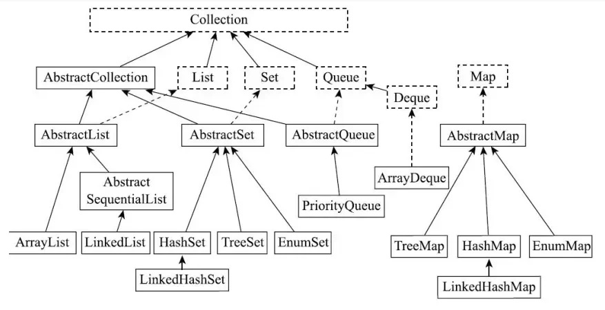

# LinkedList 简介

* 底层是双向链表；
* 支持动态扩容；
* LinkedList 不需要预分配容量，要用的时候申请一个 Node 节点即可；



## LinkedList继承关系

```java
public class LinkedList<E>
    extends AbstractSequentialList<E>
    implements List<E>, Deque<E>, Cloneable, java.io.Serializable
{
	// 
}
```

* LinkedList 继承自 `AbstractSequentialList`，该抽象类继承自`AbstractList`
* LinkedList 实现了List 接口、Deque 接口、Cloneable 接口、Serializable 接口
  * 实现 List 接口：表明 LinkedList 是一个列表，支持添加、删除、查找等操作；
  * 实现 Deque 接口：表明  LinkedList 是一种支持在两段插入、删除元素的线性数据结构；
  * 实现 Cloneable 接口：表明 LinkedList 具有拷贝能力，可以进行深拷贝、浅拷贝等动作；（该方法对该类的实例进行逐个字段的复制是合法的）
  * 实现 Serializable 接口：表明 ArrayList 可以进行序列化操作；

## LinkedList 插入 / 删除元素的时间复杂度

因为 LinkedList 底层是基于双向链表的（头尾分别有一个指针指向）

所以在头尾插入、删除元素的时间复杂度都是 O(1)；

但要删除某个指定元素/在指定位置插入元素，需要先找到该元素，平均查找次数是 n/2，所以删除指定元素/在指定位置插入元素，时间复杂度是 O(1)；

## LinkedList 为什么不能实现 RandomAccess 接口

RandomAccess 是一个标志接口，用于表示实现该接口的类支持按下标访问，而 LinkedList 底层是双向链表，各节点之间通过指针连接，地址不连续，因此不能通过下标访问，所以不能实现 RandomAccess 接口；


# LinkedList 核心源码

> 注意：LinkedList 中，头指针、尾指针是指向实际元素的，没有所谓的虚拟节点一说；

## 构造方法

```java
		/** 默认构造 **/
		public LinkedList() {
    }
		
		/** 传入集合，用集合中所有元素构造 LinkedList **/
    public LinkedList(Collection<? extends E> c) {
        this();
        addAll(c);
    }
```


## 底层数据结构

```java
    private static class Node<E> {
        E item;
        Node<E> next;
        Node<E> prev;

        Node(Node<E> prev, E element, Node<E> next) {
            this.item = element;
            this.next = next;
            this.prev = prev;
        }
    }
```

LinkedList 实际上就是将多个 Node 节点 `串联`并维护起来；

## 插入元素（以实现 List 接口的方法为例）

LinkedList 除了实现了 List 接口外，还实现了 Deque 接口，这两个接口都定义了插入元素、移除元素等方法；


LinkedList 接口提供了两个 add 方法：

```java
    /** 在链表尾部插入元素 **/
		public boolean add(E e) {
        linkLast(e);
        return true;
    }
		
		/** 在指定位置插入元素 **/
    public void add(int index, E element) {
        checkPositionIndex(index);

        if (index == size)
            linkLast(element);
        else
            linkBefore(element, node(index));
    }
		
		/** 将元素插入到链表尾部 **/
	  void linkLast(E e) {
        final Node<E> l = last;
        final Node<E> newNode = new Node<>(l, e, null);
        last = newNode;
        if (l == null)
            first = newNode;
        else
            l.next = newNode;
        size++;
        modCount++;
    }

		/** 在指定元素之前插入元素 **/
    void linkBefore(E e, Node<E> succ) {
        // assert succ != null;
        final Node<E> pred = succ.prev;
        final Node<E> newNode = new Node<>(pred, e, succ);
        succ.prev = newNode;
        if (pred == null)
            first = newNode;
        else
            pred.next = newNode;
        size++;
        modCount++;
    }
```

## 获取元素

 ```java
     /** 获取链表指定位置的元素 **/
 		public E get(int index) {
         checkElementIndex(index);
         return node(index).item;
     }
 		
 		/** 获取链表的第一个元素（实现 Deque 接口的方法） **/
     public E getFirst() {
         final Node<E> f = first;
         if (f == null)
             throw new NoSuchElementException();
         return f.item;
     }
 		
 		/** 获取链表的最后一个元素（实现 Deque 接口的方法） **/
     public E getLast() {
         final Node<E> l = last;
         if (l == null)
             throw new NoSuchElementException();
         return l.item;
     }
 ```

这里的核心方法是`node(int index)`：

```java
    /** 该方法通过判断 index 位置和链表 size 的一半的大小关系，来决定是从表头开始遍历，还是从表尾开始遍历，这样可以提高效率 **/
		Node<E> node(int index) {
        // assert isElementIndex(index);

        if (index < (size >> 1)) {
            Node<E> x = first;
            for (int i = 0; i < index; i++)
                x = x.next;
            return x;
        } else {
            Node<E> x = last;
            for (int i = size - 1; i > index; i--)
                x = x.prev;
            return x;
        }
    }
```


## 删除元素

```java
    /** 删除指定位置的元素，用到了 node()方法来提高效率 **/
		public E remove(int index) {
        checkElementIndex(index);
        return unlink(node(index));
    }
		
		/** 移除此链表中的所有元素 **/
    public void clear() {
        for (Node<E> x = first; x != null; ) {
            Node<E> next = x.next;
            x.item = null;
            x.next = null;
            x.prev = null;
            x = next;
        }
        first = last = null;
        size = 0;
        modCount++;
    }
		
		/** 删除并返回链表的第一个元素 **/
    public E removeFirst() {
        final Node<E> f = first;
        if (f == null)
            throw new NoSuchElementException();
        return unlinkFirst(f);
    }

		/** 删除并返回链表的第一个元素 **/
    public E removeLast() {
        final Node<E> l = last;
        if (l == null)
            throw new NoSuchElementException();
        return unlinkLast(l);
    }

```

这里的核心方法在于`unlink()`方法：

```java
    E unlink(Node<E> x) {
        // assert x != null;
        final E element = x.item;
        final Node<E> next = x.next;
        final Node<E> prev = x.prev;

        if (prev == null) {
            first = next;
        } else {
            prev.next = next;
            x.prev = null;
        }

        if (next == null) {
            last = prev;
        } else {
            next.prev = prev;
            x.next = null;
        }

        x.item = null;
        size--;
        modCount++;
        return element;
    }
```

代码逻辑：

1. 获取该元素值，以及该元素的前驱节点、后继节点；
2. 判断前驱节点是否为 null：若为 null，则待删除节点是头节点，将链表 first 指针后移；若不为 null，则待删除节点不是头节点，将前驱节点的后继指针指向待删除节点的后继节点
3. 判断后继节点是否为 null：若为 null，则待删除节点是尾节点，将链表 last 指针前移；若不为 null，则待删除节点不是尾节点，将后继节点的前驱指针指向待删除节点的前驱节点；
4. 将待删除节点置为 null，修改链表长度，返回节点值；

## 遍历链表--迭代器-ListItr


